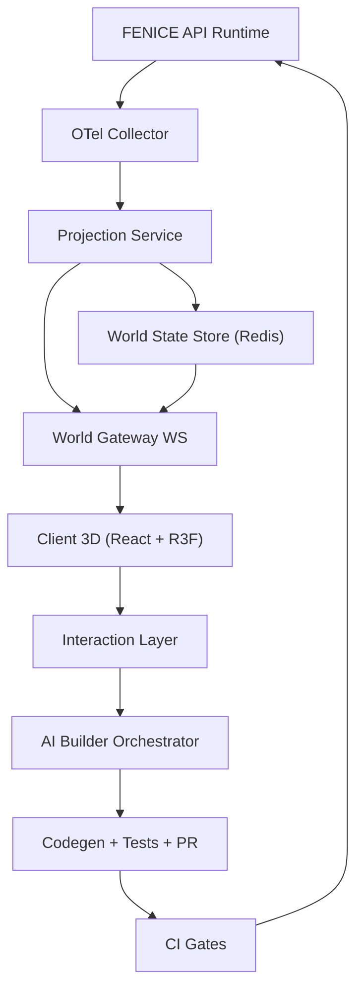

# FENICE 3D World
## Documento di approccio tecnico (Draft v0.2)

Data: 2026-02-21
Stato: Draft per allineamento team (Giuseppe + Codex + Claude)

## 1. Delta rispetto a v0.1
Questa versione aggiunge:
1. Contratto eventi realtime piu' rigoroso.
2. Decisioni architetturali formalizzate in ADR.
3. Piano operativo per integrazione con la fase 0.3.0.
4. KPI tecnici e product KPI per go/no-go.
5. Governance AI Builder con policy esplicite.

## 2. Principi guida
1. Readability first: la citta' deve spiegare il sistema in pochi secondi.
2. Source of truth unica: OpenAPI + runtime telemetry.
3. Safety by design: AI Builder opera via PR, non bypassa quality gates.
4. Performance budget esplicito: no feature senza budget.
5. Progressive complexity: prima valore osservabile, poi potenza.

## 3. Architettura target (v0.2)


### 3.1 Componenti
1. Projection Service: aggrega eventi, costruisce snapshot coerente, emette delte ordinate.
2. World State Store: cache hot state per reconnect e multi-client.
3. World Gateway: gestione sessioni WS, resume token, backpressure.
4. Client 3D: rendering, interaction, layer semantici (health/traffic/errors).
5. AI Orchestrator: pianifica cambi, genera patch e apre PR.

## 4. Contratto eventi (proposta)

### 4.1 Snapshot
```json
{
  "schemaVersion": 1,
  "worldVersion": 1024,
  "generatedAt": "2026-02-21T12:00:00.000Z",
  "services": [],
  "endpoints": [],
  "edges": [],
  "metrics": {}
}
```

### 4.2 Delta event
```json
{
  "schemaVersion": 1,
  "seq": 1025,
  "ts": "2026-02-21T12:00:00.120Z",
  "type": "endpoint.metrics.updated",
  "entityId": "endpoint:user_list",
  "payload": {
    "rps": 120,
    "p95": 180,
    "errorRate": 0.01
  }
}
```

### 4.3 Regole protocollo
1. `seq` monotono per stream.
2. At-least-once delivery lato gateway.
3. Client idempotente su `(entityId, seq)`.
4. Reconnect con `resumeToken`; fallback a snapshot + catch-up.
5. Schema versioned con compatibilita' backward su minor updates.

## 5. Strategia frontend 3D
1. Canvas unico con scene graph stabile.
2. Instancing per entita' ripetute.
3. LOD su distanza/visibilita'.
4. Overlay 2D per testo e pannelli diagnostici.
5. Update loop separato: render loop e stream loop disaccoppiati.

## 6. AI Builder governance

### 6.1 Policy
1. Ogni comando mutativo richiede scope e motivazione.
2. Ogni proposta produce patch reviewabile.
3. Esecuzione automatica obbligatoria di `lint + typecheck + test`.
4. Nessun merge automatico su branch principale.
5. Audit log con who/what/why/result.

### 6.2 Flusso
1. Prompt utente.
2. Piano diff strutturato.
3. Generazione codice + test.
4. CI gate.
5. PR con checklist rischio.
6. Merge umano.
7. Sync world model post-merge.

## 7. Integrazione con fase 0.3.0
1. Riutilizzare Redis come world hot store.
2. Riutilizzare queue workers per reconciliation/snapshot jobs.
3. Usare metrics endpoint per bootstrap mappe salute.
4. Preparare multi-tenancy model prima della collaborazione live.

## 8. KPI tecnici (go/no-go)
1. Event ingest -> world delta p95 <= 150 ms.
2. Gateway -> client apply p95 <= 150 ms.
3. End-to-end event -> render p95 <= 300 ms.
4. Reconnect + recover p95 <= 2 s.
5. FPS p95 >= 50 su hardware target.
6. Error budget WS disconnect involontari < 0.5% sessioni.

## 9. Product KPI
1. Time-to-understand architettura API < 2 minuti.
2. Time-to-diagnose anomalia comune ridotto del 30%.
3. Tempo medio da idea endpoint a PR valida < 15 minuti (AI Builder).

## 10. Sequenza di rilascio
1. Milestone M1: Static city da OpenAPI (no realtime).
2. Milestone M2: Live telemetry read-only.
3. Milestone M3: AI Builder PR-only.
4. Milestone M4: collaborazione multiutente.
5. Milestone M5: ottimizzazioni advanced (eventuale WASM).

## 11. Rischi e tradeoff
1. Overengineering precoce -> mantenere scope MVP stretto.
2. Protocollo eventi fragile -> test contract-first.
3. Costi realtime -> batching e sampling adattivo.
4. Incoerenza visuale -> reconciliation periodica e checksum world state.

## 12. ADR collegati
1. ADR-001: Event model e protocollo realtime.
2. ADR-002: World Gateway separato da WS chat.
3. ADR-003: AI Builder safety e governance.

## 13. Decisioni immediate richieste al team
1. Approvare schema v1 di Snapshot/Delta.
2. Approvare separazione gateway dedicato.
3. Approvare policy PR-only per AI Builder.
4. Approvare KPI e hardware target per benchmark.

## 14. Done criteria v0.2
1. ADR approvati.
2. Contratti JSON pubblicati e testati.
3. Piano milestone stimato con owner.
4. Dipendenze con fase 0.3.0 mappate.
